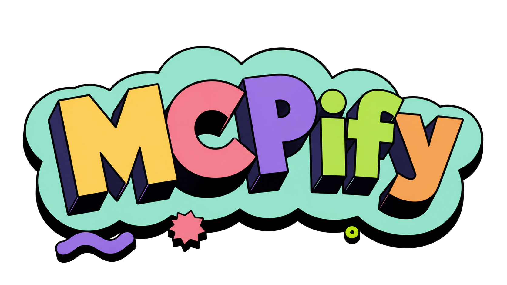

<p align="center">
  
</p>

<p align="center">
  <strong>Compile software into AI-operable systems.</strong>
</p>

<p align="center">
  MCPify is an AI enablement compiler that analyzes existing applications and generates secure, agent-ready abstractions.
</p>

<p align="center">
  <a href="#installation">Installation</a> ·
  <a href="#quick-start">Quick Start</a> ·
  <a href="#features">Features</a> ·
  <a href="#roadmap">Roadmap</a>
</p>

## Overview

MCPify is designed to turn real software into AI-native, permission-aware systems. Instead of manually writing MCP servers, tool schemas, workflow wrappers, and synchronization logic, MCPify analyzes your backend, frontend, APIs, database models, workflows, and permissions to generate structured AI-operable interfaces.

Modern products are still designed around human interaction. MCPify bridges that gap by making applications easier for AI agents to understand and operate.

## Installation

```bash
npm install -g mcpify
```

If you prefer not to install globally, you can also run it on demand:

```bash
npx mcpify
```

## Quick Start

```bash
npx mcpify
```

MCPify scans your project and generates AI-operable outputs from:

- frontend code
- backend code
- APIs and OpenAPI specs
- database models and schemas
- workflows and events
- permissions and safety boundaries

It can then produce:

- MCP servers
- AI tools
- semantic workflows
- safe actions
- permission-aware interfaces
- synchronized AI metadata

## Features

### Application Understanding

MCPify looks beyond raw functions and endpoints. It aims to interpret intent, workflow structure, UI interactions, and operational boundaries.

### Frontend Extraction

It can analyze React, Next.js, Vue, and Angular applications to identify buttons, forms, routes, state mutations, and user-facing actions.

### Backend and API Analysis

It scans TypeScript, JavaScript, services, controllers, SDKs, and OpenAPI definitions to generate structured tool and workflow abstractions.

### Workflow Extraction

MCPify can infer multi-step flows such as login, checkout, ticket creation, and order management, then package them into reusable AI workflows.

### Database Awareness

It supports schema-level analysis for tools built on Prisma, Drizzle, Mongoose, SQLAlchemy, and PostgreSQL.

### Safety and Permissions

Every generated action can be classified with permissions, approval requirements, and safety boundaries.

### Synchronization

Generated definitions stay aligned with source code as the application evolves.

## Example

```bash
npx mcpify swagger.json
```

Example output:

```txt
refundOrder(orderId)
  - schema
  - validation
  - permissions
  - AI metadata
```

## Architecture

```txt
Application
  ↓
Static Analysis Engine
  ↓
Semantic Understanding Layer
  ↓
Workflow Extraction
  ↓
Safety and Permission Layer
  ↓
MCP Generation
  ↓
AI-Operable System
```

## Stack

| Area | Technology |
| --- | --- |
| CLI | commander.js |
| AST Parsing | ts-morph |
| Validation | zod |
| Frontend Parsing | Babel / SWC |
| MCP Integration | MCP SDK |
| Formatting | prettier |
| OpenAPI Parsing | swagger-parser |
| Knowledge Graph | Neo4j / graphlib |
| AI Enhancement | OpenAI API |

## Repository Structure

```txt
mcpify/
├── packages/
│   ├── cli/
│   ├── backend-analyzer/
│   ├── frontend-analyzer/
│   ├── workflow-engine/
│   ├── schema-engine/
│   ├── mcp-generator/
│   ├── permissions/
│   ├── security/
│   ├── ai-enhancer/
│   ├── graph-engine/
│   └── templates/
```

## Roadmap

### Phase 1 - MVP

- backend analysis
- schema generation
- MCP generation
- OpenAPI support
- frontend action extraction

### Phase 2

- workflow understanding
- semantic UI understanding
- permissions
- audit system

### Phase 3

- knowledge graph
- event systems
- synchronization engine
- AI simulations

### Phase 4

- enterprise deployment
- hosted platform
- monitoring
- analytics
- AI operating layer

## Why MCPify

Traditional AI integrations require teams to manually expose APIs, build MCP servers, define tool schemas, add safety layers, and keep everything in sync. MCPify is intended to reduce that overhead by compiling application structure into AI-ready operations.

## Taglines

- Compile software into AI-operable systems.
- Turn applications into AI-native environments.
- The AI interface layer for software.
- Make any application usable by AI agents.
- From software to AI-operable systems instantly.

## License

This project is intended to be licensed under Creative Commons Attribution 4.0 International (CC BY 4.0).

If you want a more conventional software license for package distribution, consider MIT or Apache 2.0 instead.
